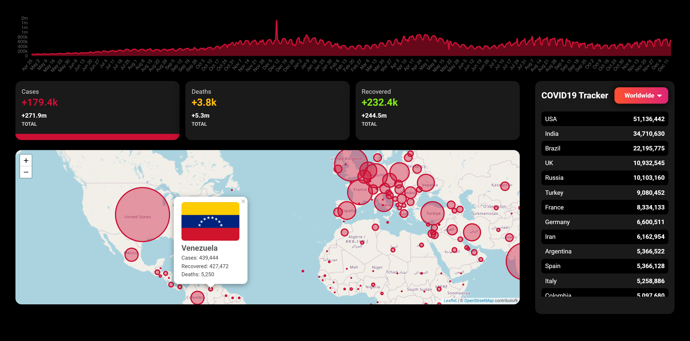

<h1 align="center"> COVID19 Tracker</h1>

<h3 align="center">COVID19 Tracker built with React.js and Material-UI for learning and practicing purposes.</h3>

---

### Demo :chart:

Use the dropdown menu to track COVID19 cases, deaths and recovered in each country or worldwide  
[COVID19 Tracker](https://spotify-clone-kappa-two.vercel.app/login)

### Prerequisite :hammer_and_wrench:

Make sure you have these installed

- [Node.js](https://nodejs.org/en/)
- [git](https://git-scm.com/)

### Instructions :gear:

1. Clone this repository into your local machine using the terminal (mac) or Gitbash (PC) `git clone https://github.com/ahmdabdelsamea/spotify-clone.git`
2. CD to the folder `cd spotify-clone`
3. Run `npm install` to install the project dependencies
4. Run `npm start` to run the project at http://localhost:3000

### :rocket: Technologies

- [React](https://reactjs.org/)
- [leaflet](https://leafletjs.com/)
- [react-leaflet](https://react-leaflet.js.org/)
- [chart.js](https://www.chartjs.org/)
- [react-chartjs-2](https://react-chartjs-2.netlify.app/)
- [numeral](http://numeraljs.com/)
- [MaterialUI](https://mui.com/)
- [Firebase](https://firebase.google.com/)

> Made with :heart: by Ahmed Abdelsamea _aka BNA_
